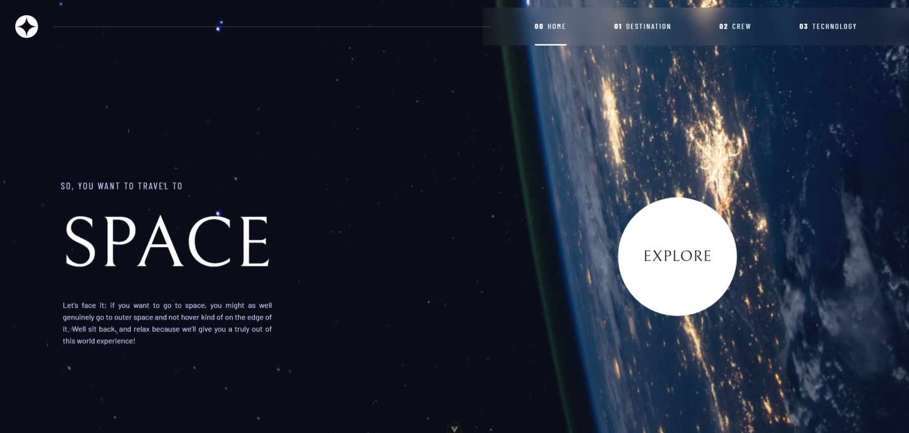

# Frontend Mentor - Space tourism website solution

This is a solution to the [Space tourism website challenge on Frontend Mentor](https://www.frontendmentor.io/challenges/space-tourism-multipage-website-gRWj1URZ3). Frontend Mentor challenges help you improve your coding skills by building realistic projects.

## Table of contents

- [Frontend Mentor - Space tourism website solution](#frontend-mentor---space-tourism-website-solution)
  - [Table of contents](#table-of-contents)
  - [Overview](#overview)
    - [The challenge](#the-challenge)
    - [Screenshot](#screenshot)
    - [Links](#links)
  - [My process](#my-process)
    - [Built with](#built-with)
    - [What I learned](#what-i-learned)
    - [Continued development](#continued-development)
    - [AI Collaboration](#ai-collaboration)
  - [Author](#author)

**Note: Delete this note and update the table of contents based on what sections you keep.**

## Overview

### The challenge

Users should be able to:

- View the optimal layout for each of the website's pages depending on their device's screen size
- See hover states for all interactive elements on the page
- View each page and be able to toggle between the tabs to see new information

### Screenshot

### Links

- Solution URL: [Github](https://github.com/Odiesta/space-tourism-website)
- Live Site URL: [Netlify](https://delightful-monstera-2b27d3.netlify.app/)

## My process

### Built with

- Semantic HTML5 markup
- Typescript
- Tailwind
- Flexbox
- Mobile-first workflow
- [Vue](https://vuejs.org/) - JS library

### What I learned

I Learn how to setup vue project like setting route, pinia for store, type, components, using utils. How to work with github flow by setting up branch for main, develop, feature. Create a website that follow WCAG, learn to use swiper.

### Continued development

I'm very happy to complete this challenge. I started joining this challenge 4 years ago. At that time i don't know how to approach the problem, i haven't learn frontend framework and back then there's no AI. My goal is to practice everyday for at least 30 minutes a day

### AI Collaboration

I use Gemini when i get stuck on problem. I paste the code and related code as one file in gemini and ask what the problem and how to fix it. I use claude sonnet when i get stuck on hard problem like image not load because it's not in public folder instead in src/asset

## Author

- Frontend Mentor - [@Odiesta](https://www.frontendmentor.io/profile/Odiesta)
- X - [@OdiestaS](https://x.com/OdiestaS)
